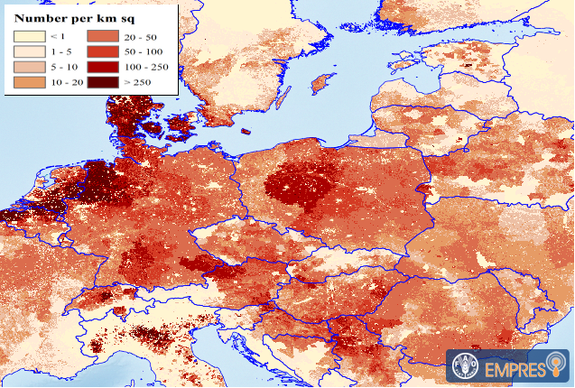

```{r setup, include=FALSE}
knitr::opts_chunk$set(echo = FALSE, message = FALSE, warning = FALSE)
```

```{r}
library(tidyverse)
library(lubridate)
library(leaflet)
library(sp)
library(knitr)
library(kableExtra)

EMP <- readLines("./Empress.csv")
EMP <- gsub("^\"|\"$", "", EMP)
EMP <- gsub("\"\"", "\"", EMP)

EMP2 <- read.csv(text = EMP, header=FALSE, stringsAsFactors = FALSE)
colnames(EMP2) <- as.character(EMP2[1,])
EMP2 <- EMP2[-1, -c(21:26)]

EMP2$reportingDate <- dmy(EMP2$reportingDate)

```

This is just an example of a report. The data used below is openly accessible on [Empres-i](http://empres-i.fao.org/empres-i) and this is ASF in Europe region.  Please note that the site is sometimes down, and might be selective to what browser you use. I ended up useing 'firefox' for data retrieval.
Empres-i have some nifty mapping ang graphing tools as well, but I like the markdown.

Any text here marked as *cursive* is from the data, so if you would provide a different timeperiod of the data it responds and shows the new data. 

I selected data from January 1st 2018 to July 31st 2018. In this interval the first date is *`r min(EMP2$reportingDate)`* and the last date is *`r max(EMP2$reportingDate)`*. In the dataset there are *`r nrow(EMP2)`* reports of outbreaks. As there are both wildboar and domestic cases, it tables as: 

```{r}

EMP22 <- tally(group_by(EMP2, country, speciesDescription))

kable(EMP22,"html") %>%
    kable_styling(bootstrap_options = "striped", full_width = FALSE, position = "left")
```

I might prefer to see species side by side instead:

```{r}
EMP22_wd <- EMP22 %>% 
  spread(speciesDescription, n)
EMP22_wd <- replace_na(EMP22_wd, list("domestic, swine" = 0, "wild, wild boar" = 0))
kable(EMP22_wd, "html") %>%
   kable_styling(bootstrap_options = "striped", full_width = FALSE, position = "left")

```

## Graphs

```{r}
ggplot(EMP2, aes(floor_date(reportingDate, "months"), fill = speciesDescription)) +
  geom_bar(color = "black", position = "dodge") +
  theme(legend.position = "top") +
  theme(legend.title = element_blank()) +
  xlab("") +
  ylab("number of reports") +
  scale_x_date(date_labels = "%Y\n%b")+
  ggtitle("Number of reports of ASF in Europe, by month")

```

I might just wanna see the cases in wild boar from a select few countries: 

```{r}
EMP2_sel <- EMP2 %>%
  filter(speciesDescription == "wild, wild boar") %>%
  filter(country == "Czech Republic" | country == "Poland" | country == "Latvia" )


ggplot(EMP2_sel, aes(floor_date(reportingDate, "month"), fill = country)) +
  geom_bar(color = "black", position = "stack") +
  scale_fill_brewer(palette = "Blues")+
  ggtitle("ASF cases, Cz, Lv, Pl") +
  scale_x_date(date_labels = "%Y\n%b")+
  theme(legend.position = "top") +
  theme(legend.title = element_blank()) +
  xlab("") +
  ylab("Number of reports")
```


## Map

Below is a map created by usage of "leaflet"-package. th map is interactive, scroll or use the button included to zoom - reposition by drag-and-drop. If you click a point it gives the date and source of information for wild boar points, alternatively the number at risk for domestic pigs. 

```{r}
asfmap <- EMP2

asfmap$reportingDate <- as.Date(asfmap$reportingDate, format = "%d/%m/%Y")


asfdp_map <- filter(asfmap, speciesDescription == "domestic, swine" )
asfwb_map <- filter(asfmap, speciesDescription == "wild, wild boar" )


# convert to sp object and assign projection

coordinates(asfdp_map) <- cbind(as.numeric(asfdp_map$longitude), as.numeric(asfdp_map$latitude))
proj4string(asfdp_map)<- CRS("+proj=longlat +datum=WGS84 +ellps=WGS84 +towgs84=0,0,0")

coordinates(asfwb_map) <- cbind(as.numeric(asfwb_map$long), as.numeric(asfwb_map$lat))
proj4string(asfwb_map)<- CRS("+proj=longlat +datum=WGS84 +ellps=WGS84 +towgs84=0,0,0")


# popup
popup_wb <- paste("Datum:", asfwb_map@data$reportingDate, "<br>",
                  "Source:", asfwb_map@data$source)

popup_dp <- paste("Datum:", asfdp_map@data$reportingDate, "<br>",
                  "Number at risk:", asfdp_map@data$sumAtRisk)


#plot map
m <- leaflet()
m <- addTiles(m, urlTemplate = "http://{s}.tile.openstreetmap.org/{z}/{x}/{y}.png")
m <- addCircleMarkers(m, data = asfwb_map, radius = 0.5, popup = popup_wb) 
m <- addCircleMarkers(m, data = asfdp_map, radius =  1, color = "#cb181d", fillOpacity = 1, popup = popup_dp)

m <- addScaleBar(m)
m
```
Red dots = domestic cases, blue dots = wild boar


### Pictures
Here is a static picture of pig density in europe (2010) from Empres-i as comparison


